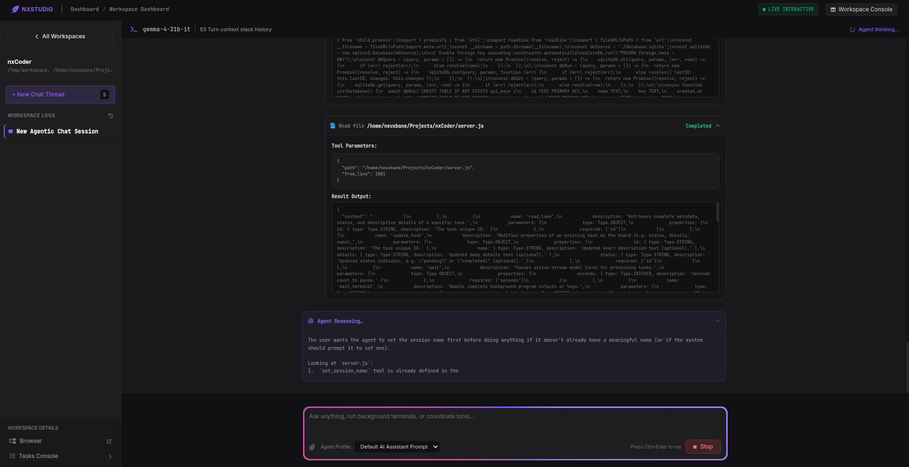
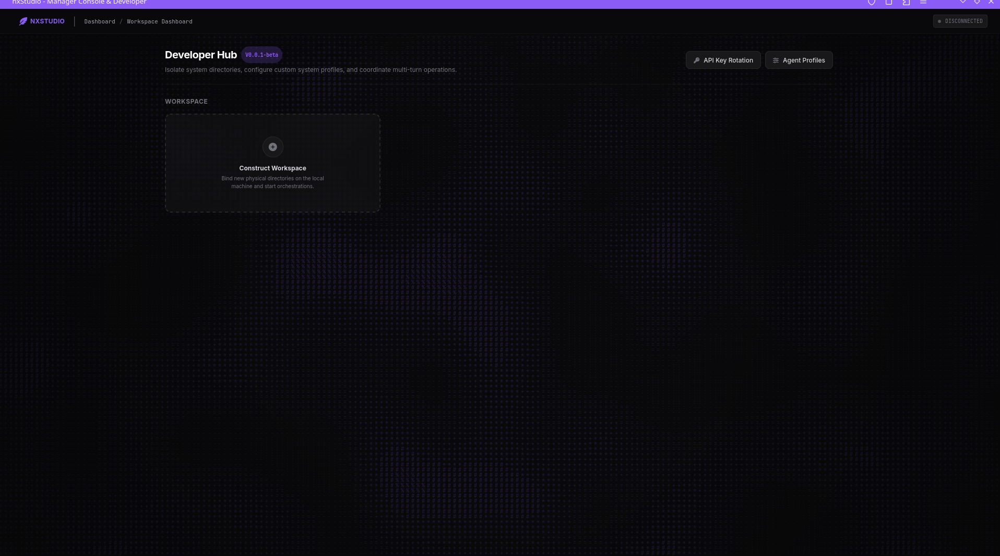

# nxCoder / nxStudio



nxCoder (also known as nxStudio) is an AI-powered agentic developer environment designed to streamline the software development process by integrating a powerful AI assistant directly into your workspace.

## 🚀 Overview

nxCoder provides a comprehensive suite of tools that allow an AI agent to interact with your local environment, manage files, execute commands, and even control a web browser, all within a secure and isolated workspace.

## ✨ Key Features

- **AI-Driven Interaction**: Deep integration with **Google Gemini (GenAI)** for intelligent code generation, debugging, and architectural advice.
- **Agentic Tooling**: The AI can perform real-world actions:
    - **File System Access**: Read, write, and edit files within the project workspace.
    - **Command Execution**: Run shell commands to build, test, and deploy code.
- **Workspace Management**: Ensures that the AI operates within a designated mirror directory, preventing accidental changes to critical system files.
- **Browser & Device Control**: Integration with **Playwright** allows the agent to navigate websites, take screenshots, and interact with web applications for automated testing and verification.
- **Real-time Communication**: Powered by **WebSockets** for instant updates between the AI agent and the user interface.



## 🛠️ Requirements & Compatibility

### OS Compatibility
- **Tested on**: Linux / Arch Linux distribution.
- *Note: Other distributions and operating systems have not been tested.*

### System Requirements
- **Runtime**: [Node.js](https://nodejs.org/) (Latest LTS recommended).
- **API Key**: A valid **Google Gemini API key**.
- **Dependencies**: Playwright system dependencies are required for browser automation.

## 🏁 Getting Started

### Installation

1. Clone the repository:
   ```bash
   git clone <repository-url>
   cd nxcoder
   ```

2. Install dependencies:
   ```bash
   npm install
   ```

3. Install Playwright browsers:
   ```bash
   npx playwright install --with-deps
   ```

### Configuration

Create a configuration file or set your environment variables with your Gemini API key:
```env
GEMINI_API_KEY=your_api_key_here
```

### Running the Server

Start the nxCoder server:
```bash
node server.js
```
The server will start, and you can access the interface through your browser.

## 💻 Tech Stack

- **Backend**: Node.js, Express
- **AI Engine**: Google GenAI (@google/genai)
- **Database**: SQLite3
- **Browser Automation**: Playwright
- **Communication**: WebSockets (ws)
- **Image Processing**: Sharp
- **Markdown Rendering**: markdown-it
